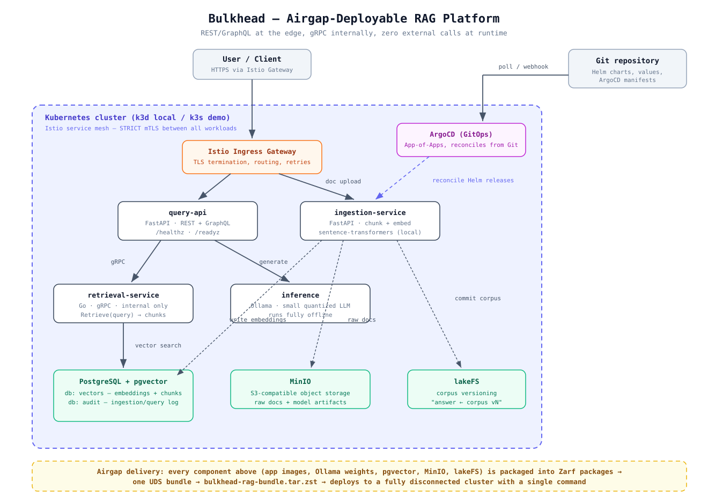

# Architecture

## The shape of the system

Four moving parts behind one mTLS mesh:

- **ingestion-service** (FastAPI) — chunks documents, embeds them locally with `sentence-transformers/all-MiniLM-L6-v2` (baked into the image), writes vectors to PostgreSQL+pgvector and raw bytes to MinIO. Every ingestion run is committed to lakeFS, so any answer can be traced back to an immutable corpus version.
- **retrieval-service** (Go, gRPC) — the only component that talks to pgvector. Internal-only: no ingress route, reachable through the mesh with strict mTLS.
- **query-api** (FastAPI) — public REST edge. Calls retrieval over gRPC, then hands the prompt plus retrieved chunks to the local model server.
- **inference** (Ollama, CPU-only) — serves `llama3.2:1b` at Q4_K_M with weights baked into the image. No API keys exist anywhere in this system; there is nothing to leak because nothing external is called.

## Why this topology

REST at the edge, gRPC inside — the classic split that shows where latency matters and where contracts matter. The vector store is never publicly routable. The mesh gives every hop mTLS by default (`PeerAuthentication: STRICT`) rather than as an afterthought.

## Two delivery mechanisms, one codebase

The same Helm charts deploy both modes:

- **Connected demo**: ArgoCD reconciles from Git onto the free-tier VM; images come from ghcr.io.
- **Airgap**: the same charts are packaged by Zarf with all images and model weights, composed into one UDS bundle; deployment happens from that single file with no egress.

The packaging layer is the only thing that changes between connected and disconnected delivery — which is the entire point.
